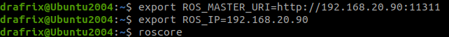
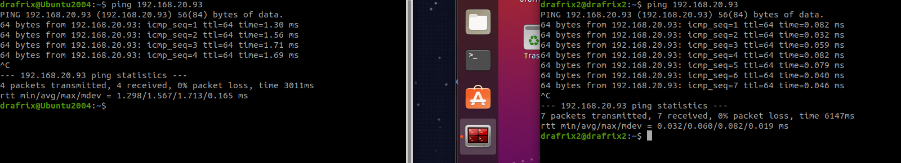
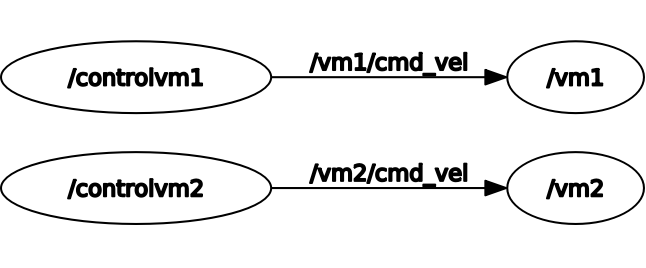
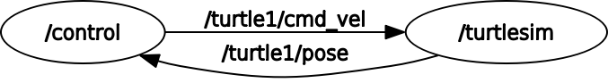
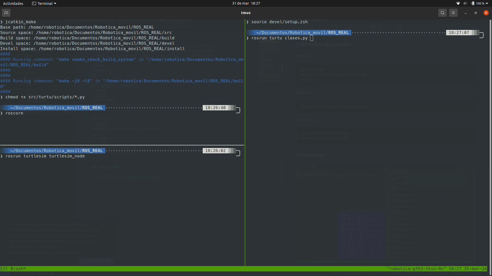
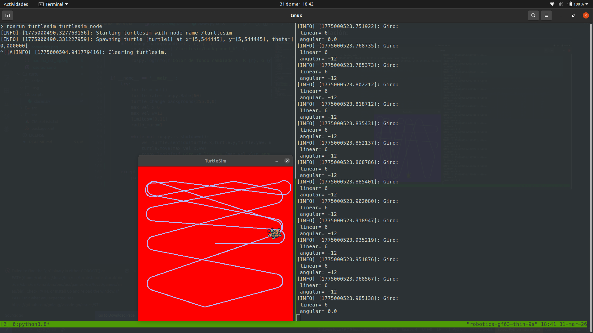

# Fundamentos de Robótica Móvil: Laboratorio 2

## Integrantes
  - Javier Danilo Tovar Rodriguez
  - David Felipe Ruiz Reyes
  - Diego Andres Fernandez Sosa

## ACTIVIDAD 1
## Descripción:
Se desea realizar la comunicación de varios nodos del paquete Turtlesim a traves de la red y dos 'End Device'.

## Comandos ejecutados:

En cada terminal para ambas máquinas virtuales se ha de indicar la dirección IP de la VM y la dirección donde estará el ROS Master. Para ello se usan los siguientes comandos:



La verificación de comunicación entre las VM se realiza con el comando 'ping' de la siguiente forma:




A partir de establecer correctamente la ubicación de cada terminal en la red, se inicia un ROS Master y la coordinación de las conexiones con el siguiente comando:

Terminal 1 (ROS MASTER):
```bash
roscore
```

En la primera VM se inicia su tortuga y el control para la segunda VM con los siguientes comandos:

Terminal 2 (Tortuga VM1):
```bash
rosrun turtlesim turtlesim_node __name:=vm1 /turtle1/cmd_vel:=/vm1/cmd_vel
```
Terminal 3 (Control para Tortuga VM2 en VM1):
```bash
rosrun turtlesim turtle_teleop_key __name:=controlvm2 /turtle1/cmd_vel:=/vm2/cmd_vel
```

En la segunda VM se realiza un proceso similar, en donde se identifica que cada nodo debe tener nombre único y se especifica o remapean los tópicos para que el control este dirigido correctamente.

Terminal 4 (Tortuga VM2):
```bash
rosrun turtlesim turtlesim_node __name:=vm2 /turtle1/cmd_vel:=/vm2/cmd_vel
```
Terminal 5 (Control para Tortuga VM1 en VM2):
```bash
rosrun turtlesim turtle_teleop_key __name:=controlvm1 /turtle1/cmd_vel:=/vm1/cmd_vel
```

Por último, se verifican las conexiones con el siguiente comando:

Terminal 6 (Verificación):
```bash
rqt_graph
```

## Video de ejecución:

Comunicación de una primera tortuga con un primer control.

[](https://youtu.be/RekJCz4C1Iw)

> **Nota:** Si no tienes acceso a YouTube, también puedes ver el video desde el repositorio:
> **[▶️ Ver versión local del video](.img/Lab2_primerturtle.mp4)**


Comunicación de dos tortugas con sus controles en máquinas virtuales distintas.

[](https://youtu.be/bwPI6IR05ww)

> **Nota:** Si no tienes acceso a YouTube, también puedes ver el video desde el repositorio:
> **[▶️ Ver versión local del video](.img/Lab2_dosturtle.mp4)**




## ACTIVIDAD 2

## Descripción:

### Nodo:
 Este laboratorio consiste en el control de una tortuga en el entorno de ROS, para ello se utiliza el lenguaje de programación Python y la librería rospy.

 Con la creación de una clase bot, la cual contiene las propiedades propias de un robot, como la posición, velocidad y orientación, y los metodos necesarios para el control de la tortuga.

 En la clase, se inicializa un nodo denominado **control** el cual se suscribe al topico **/turtle1/pose** para obtener la posición de la tortuga y publica en el topico **/turtle1/cmd_vel** para controlar la velocidad de la tortuga. esta configuración se observa a continuación:

 

 ### Clase bot:
   La clase bot, contiene los siguientes comportamientos:
   - **__init__**: Inicializa el nodo y los tópicos
   - **callback_pose**: Callback para obtener la posición de la tortuga
   - **move**: Método para mover la tortuga con velocidad lineal y angular
   - **goto**: Método para mover la tortuga a un objetivo

  ### Logica aplicada:
  El bot se mueve en una trayectoria lineal a velocidad constante, hasta que su posición absoluta se aproxima a uno de los muros, lo cual se evalua mediante la siguiente condición:

  $$ 
   x \notin (1, 10) \lor y \notin (1, 10)
  $$ 

  En cuanto el bot detecta que se encuentra fuera del area delimitada por los muros, entra en un estado de giro, en el cual se conserva la velocidad lineal, pero se añade una velocidad angular optimizandola de acuerdo al angulo en el cual se encuentra orientado el bot.

## Diagrama de flujo:

### Maquina de estados:
El comportamiento del robot, conserva una velocidad lineal constante y determina una velocidad angular basada en una dirección optima de movimiento, la cual se calcula mediante la diferencia entre el angulo actual y el angulo objetivo.

$$
\theta_{error} =tan^{-1}\left(\frac{\sin(\theta_{obj} - \theta_{act})}{\cos(\theta_{obj} - \theta_{act})}\right)
$$

Al usar la funcion de numpy arctan2, se obtiene el angulo mapeado correctamente en el cuadrante deseado, lo que permite determinar la dirección del giro optimo.


### Desiciones del bot:
Con el algoritmo implementado, el angulo objetivo se determina mediante la siguiente lógica:

$$
\begin{array}{|c|c|c|c|}
\hline
\text{Posicion en X} & \text{Posicion en Y} & \text{Dirección deseada} & \text{Angulo Obj (°)} \\
\hline
\text{>10} & \text{>10} & \text{[-1,-1]} & \text{-135} \\
\text{<1} & \text{>10} & \text{[1,-1]} & \text{-45} \\
\text{>10} & \text{<1} & \text{[-1,1]} & \text{135} \\
\text{<1} & \text{<1} & \text{[1,1]} & \text{45} \\
\text{>=1 <=10} & \text{>10} & \text{[0,-1]} & \text{-90} \\
\text{>=1 <=10} & \text{<1} & \text{[0,1]} & \text{90} \\
\text{>10} & \text{>=1 <=10} & \text{[-1,0]} & \text{180} \\
\text{<1} & \text{>=1 <=10} & \text{[1,0]} & \text{0} \\
\text{>=1 <=10} & \text{>=1 <=10} & \text{[-,-]} & \text{-} \\
\hline
\end{array}
$$

## Comandos ejecutados:

Importante, en caso de actualizar python, se debe modificar el constructor de catkin_make para que pueda usar la versión de python deseada, el cual se puede añadir a .bashrc y es el siguiente:

```bash
alias jcatkin_make='catkin_make -DPYTHON_EXECUTABLE=/usr/bin/python3.8'
```


Terminal 1:
```bash
catkin_make
chmod +x src/turtu/scripts/*.py
roscore
```
Terminal 2:
```bash
rosrun turtlesim turtlesim_node
```
Terminal 3:
```bash
source devel/setup.bash
rosrun turtu clases.py
```


## Simulación:



## Video de ejecución:

Se usa el comando personalizado **jcatkin_make** para compilar el proyecto.

[](https://www.youtube.com/watch?v=PXtsvDfo-fI)

> **Nota:** Si no tienes acceso a YouTube, también puedes ver el video desde el repositorio:
> **[▶️ Ver versión local del video](.img/Ejecución_video.mp4)**
